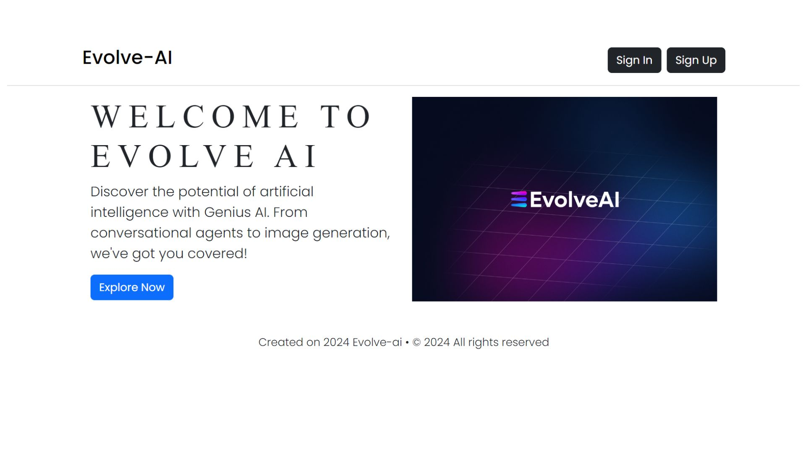
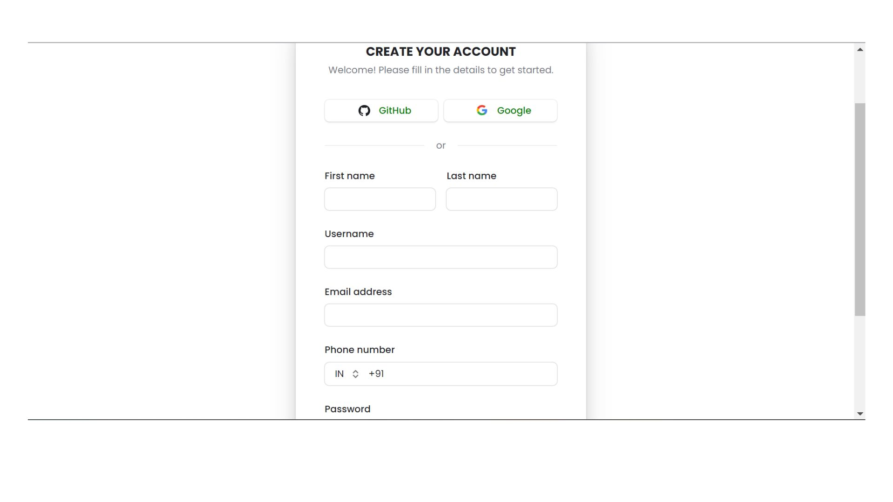
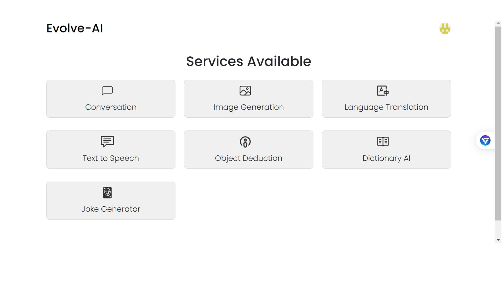
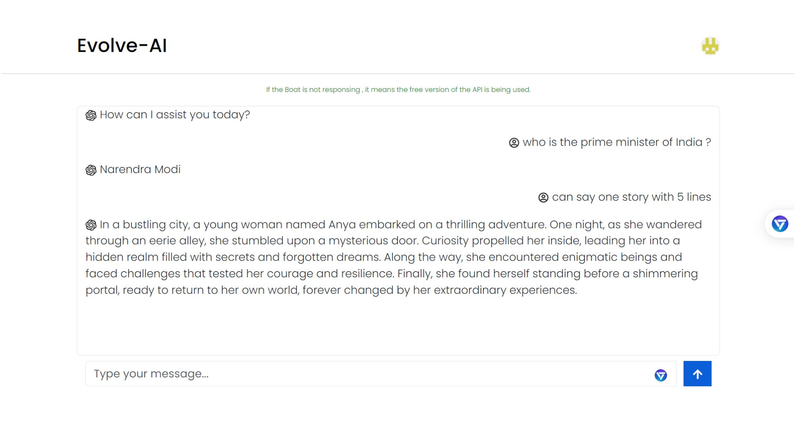
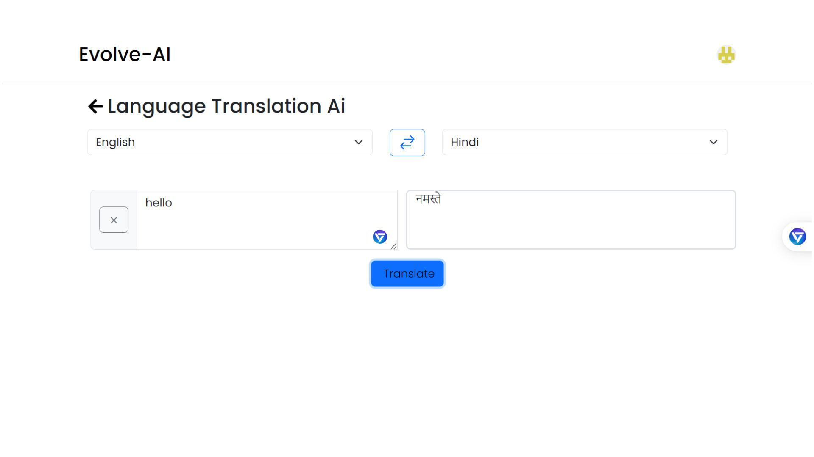
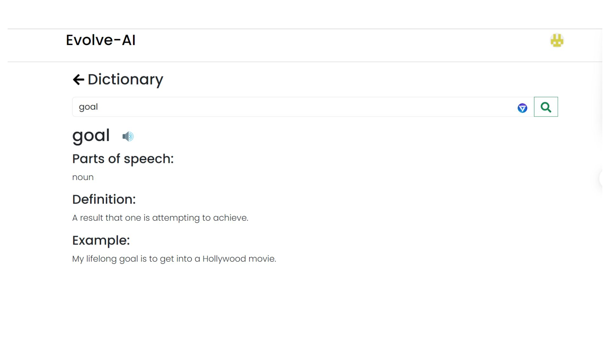
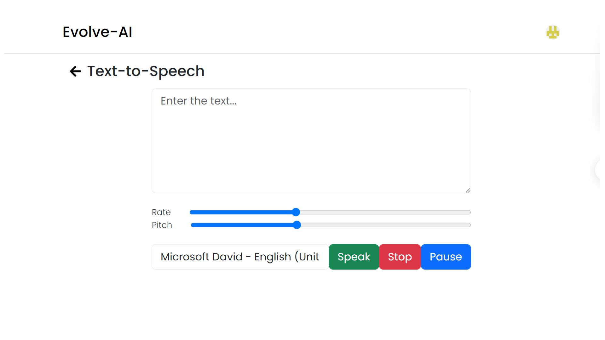

# Evole AI

## Description

A dynamic and responsive web application built using React.js and Redux, designed to provide a seamless user experience with extensive features and integrations.

## Frontend

Built using React.js and  ensuring a dynamic and responsive user interface.

## Screenshots








## Features

- **User Authentication:** 
  - Integrated Clerk for user authentication.
  - Users can log in via phone number verification, email verification, or social media accounts like GitHub.

- **AI Integration:**
  - **Conversational AI:** Leveraged [Gemini API](https://aistudio.google.com/app/apikey) for sophisticated conversational capabilities.
  - **Image Generation:** Utilized [Rapid API](https://rapidapi.com/hub) for generating images.
  - **Language Translation:** Integrated translation services via [Rapid API](https://rapidapi.com/hub).
  - **Dictionary Services:** Provided dictionary functionalities through [Rapid API](https://rapidapi.com/hub).
  - **Object Detection:** Enabled object detection features via [Rapid API](https://rapidapi.com/hub).
  - **Joke Generation:** Implemented joke generation using [Rapid API](https://rapidapi.com/hub).

- **Responsive Design:** Ensured the application is mobile-friendly and visually appealing on all devices using Bootstrap.

## Technologies Used

- **Frontend:** React.js, Redux
- **Authentication:** Clerk
- **AI Services:** Gemini API, Rapid API
- **Design:** Bootstrap, Responsive Design

## Installation

1. Clone the repository:
   ```bash
   git clone https://github.com/yourusername/evole-ai.git
   cd evole-ai
   ```

2. Install the dependencies
```bash
npm install
```
3.Set up environment variables:
Create a .env file in the root directory.
Add the necessary API keys and configurations for Clerk, Gemini API, and Rapid API.

4. Start the development server:
```bash
npm start
```
Usage
User Authentication:

Users can sign up or log in using phone number, email, or social media accounts.
AI Features:

Access conversational AI, image generation, language translation, dictionary services, object detection, and joke generation through the application interface.


